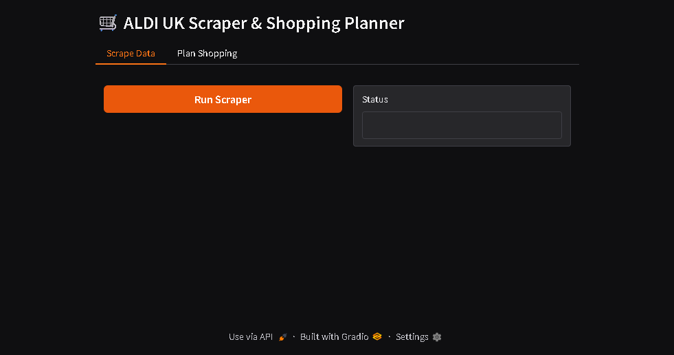
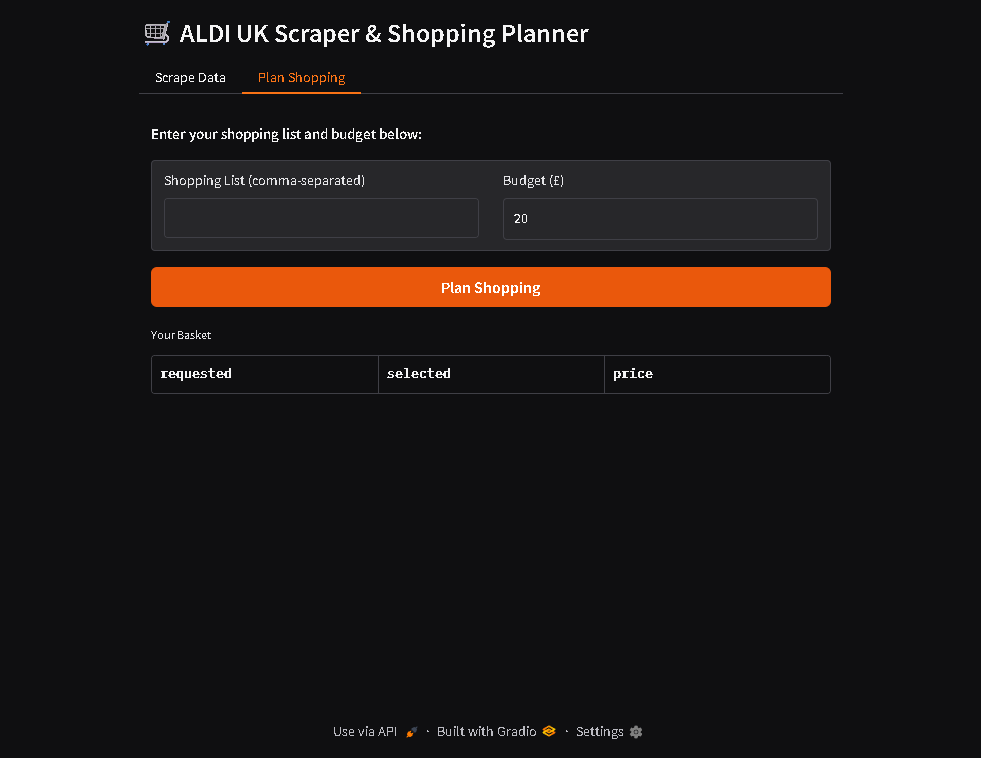

<p align="center">
  
</p>

# ALDI UK Shop Planner 🛍️

> **Your AI-powered sidekick for ALDI UK groceries!**

No more second-guessing prices or overspending at the till. With one click you can:

1. **🍏 Scrape** the full ALDI UK catalogue into a CSV.  
2. **🔍 Plan** a budget-friendly basket using a tiny, on-device LLM.

Everything runs locally—your data never leaves your machine.

---

## 📸 Screenshots

<p align="center">
  
</p>

*Run the scraper and see your product count instantly.*

<p align="center">
  
</p>

*Enter a shopping list & budget, then watch your AI-chosen basket appear.*

---

## 🚀 Quick Start

1. **Clone** this repo:
   ```bash
   git clone https://github.com/ColinJK/aldi-uk-psasp.git
   cd aldi-shop-planner
   ```


2. **Create** and **activate** a virtual environment:

   ```bash
   python -m venv .venv
   source .venv/bin/activate    # macOS/Linux
   .\.venv\Scripts\activate     # Windows PowerShell
   ```

3. **Install** dependencies:

   ```bash
   pip install --upgrade pip
   pip install -r requirements.txt
   ```

4. **Download** a compact GGUF model (<1 GB) from our recommendations below.

5. **Point** the app at your model:

   ```bash
   export LLAMA_MODEL_PATH="/path/to/your/model.gguf"   # macOS/Linux
   setx LLAMA_MODEL_PATH "C:\Models\your_model.gguf"    # Windows
   ```

6. **Launch** the app:

   ```bash
   python main.py
   ```

   Then open 👉 [http://127.0.0.1:7860](http://127.0.0.1:7860) in your browser.

---

## 💚 Model Picks (<1 GB)

| Model                                                | Size    | Link                                                                                                                                 |
| ---------------------------------------------------- | ------- | ------------------------------------------------------------------------------------------------------------------------------------ |
| **tensorblock/mistral-1.1b-testing-GGUF (Q4\_K\_M)** | 0.62 GB | [https://huggingface.co/tensorblock/mistral-1.1b-testing-GGUF](https://huggingface.co/tensorblock/mistral-1.1b-testing-GGUF)         |
| **afrideva/malaysian-mistral-1.1B-4096-GGUF**        | 0.68 GB | [https://huggingface.co/afrideva/malaysian-mistral-1.1B-4096-GGUF](https://huggingface.co/afrideva/malaysian-mistral-1.1B-4096-GGUF) |

---

## 🎯 What’s Inside?

* **main.py**         – One-page Gradio app with two tabs:

  * **Scrape Data**: runs `scrape_aldi.py` via Selenium.
  * **Plan Shopping**: uses RAG + LLM to pick your basket.
* **scrape\_aldi.py**  – Headless-Chrome scraper exporting `aldi_uk_groceries.csv`.
* **requirements.txt** – All necessary Python packages.

---

## ⚙️ Tips & Tricks

* **ChromeDriver**: Ensure your ChromeDriver version matches Chrome.
* **Model Path**: Double-check `LLAMA_MODEL_PATH` if you see load errors.
* **Budget Alerts**: Green ✅ under budget, ⚠️ slightly over, ❌ well over.

---

## 🤝 Contributing & License

Pull requests and ⭐️ are welcome!
MIT © Colin Kidwell

